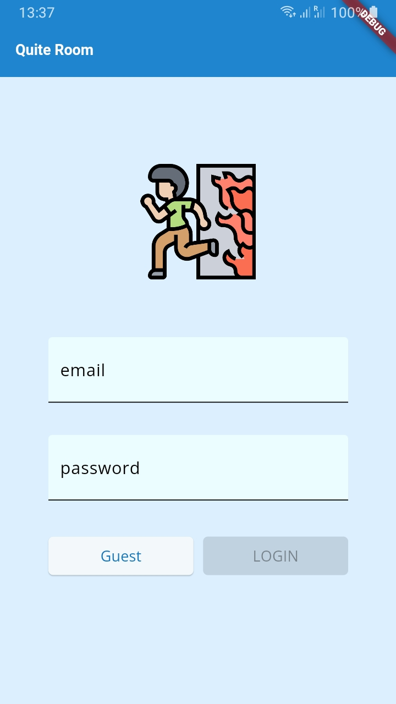
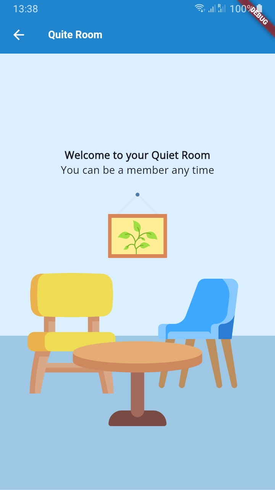
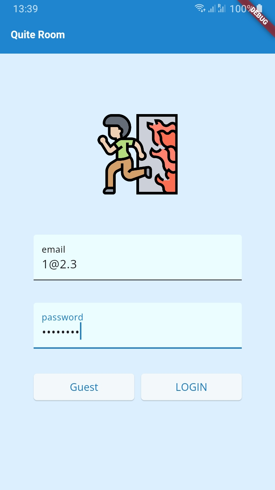
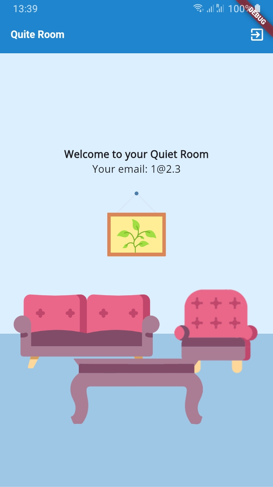

# Quiet Room

A small Flutter application showcasing Firebase Authentication integration with a clean and modular code structure.

## The app features

### A) Login Screen
Guests can seamlessly access the Home Screen, a virtual room, without the need for credentials. They are greeted with four photos depicting two chairs, a table, and a picture frame on the wall. These images ingeniously combine to create a reception room, complete with a background line to enhance perspective.

### B) Home Screen
Registered users log in to the Home Screen using their email and password. Upon successful login, they are treated to four photos portraying a chair, sofa, table, and a picture frame on the wall. These images are artfully combined to form a cozy living room ambiance.

### C) State Management
Flutter BLoC is employed for effective state management, utilizing Cubits specifically for handling login state.

### D) Repository Pattern
The repository pattern is implemented to efficiently manage data. Three distinct packages—authentication, cache, and form inputs—are created, aligning with official documentation (Bloc Library, 2024).

### E) Material 3 UI
I attempt to implement the Material 3 UI. Yet, Flutter version 3.16 onwards indecates that useMaterial3 being true by default.

## Screenshot
|  |  |  |  |
|--------------------------------------------|--------------------------------------------|--------------------------------------------|--------------------------------------------|

## Reference:
Bloc Library. (2024). Flutter Firebase Login Tutorial. Retrieved from https://bloclibrary.dev/#/flutterfirebaselogintutorial
